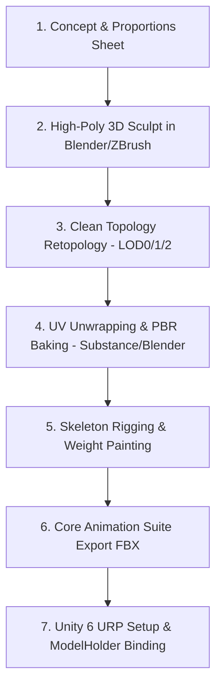

# MONKEY ADVENTURE — STEP 02: REAL 3D MONKEY HERO AUDIT & CREATION PIPELINE

**Execution Date:** 2026-08-19  
**Engine:** Unity 6 (`6000.5.8f1`) URP  
**Target Protagonist:** Young Jungle Monkey (Cinematic Stylized-Realistic 3D Hero)  
**Document Path:** `Assets/Documentation/ProjectAudit/STEP02_Monkey_Character_Audit.md`  

---

## 1. Existing Character Assets in Project

A comprehensive scan of all 3D character meshes, rigs, FBXs, OBJs, GLBs, prefabs, and textures across the entire project repository was performed.

| Asset Path | Asset Type | Rig / Skeleton | Tri Count / Detail | Quality Classification |
| :--- | :--- | :--- | :--- | :--- |
| `Assets/Furry Squirrel/Meshes/Squirrel.fbx` | 3D Animal FBX | Custom Rig (32 bones) | ~14,500 tris (Multi-shell fur) | **B. REAL ANIMAL** |
| `Assets/Furry Squirrel/Prefab/Squirrel_URP.prefab` | Rigged Prefab | SkinnedMeshRenderer | PBR + Fur Shader + Animations | **D. INTERIM PROXY ONLY** |
| `Assets/ithappy/Animals_FREE/Meshes/Deer_001.fbx` | 3D Animal FBX | Quadruped Rig | ~3,200 tris (Stylized) | **B. REAL ANIMAL** |
| `Assets/ithappy/Animals_FREE/Meshes/Dog_001.fbx` | 3D Animal FBX | Quadruped Rig | ~2,800 tris (Stylized) | **B. REAL ANIMAL** |
| `Assets/ithappy/Animals_FREE/Meshes/Horse_001.fbx` | 3D Animal FBX | Quadruped Rig | ~3,600 tris (Stylized) | **B. REAL ANIMAL** |
| `Assets/ithappy/Animals_FREE/Meshes/Kitty_001.fbx` | 3D Animal FBX | Quadruped Rig | ~2,400 tris (Stylized) | **B. REAL ANIMAL** |
| `Assets/ithappy/Animals_FREE/Meshes/Pinguin_001.fbx` | 3D Animal FBX | Biped Rig | ~1,800 tris (Stylized) | **B. REAL ANIMAL** |
| `Assets/ithappy/Animals_FREE/Meshes/Tiger_001.fbx` | 3D Animal FBX | Quadruped Rig | ~3,800 tris (Stylized) | **B. REAL ANIMAL** |
| `Assets/ithappy/Animals_FREE/Meshes/Chicken_001.fbx` | 3D Animal FBX | Biped Rig | ~1,600 tris (Stylized) | **B. REAL ANIMAL** |
| `Assets/Art/Characters/Monkey_Base.prefab` | Procedural Prefab | None (Parented Transforms) | Unity Sphere/Capsule primitives | **C. PRIMITIVE PLACEHOLDER** |
| `Assets/Art/Characters/Monkey_Guardian.prefab` | Procedural Prefab | None (Parented Transforms) | Primitive recolor | **C. PRIMITIVE PLACEHOLDER** |
| `Assets/Art/Characters/Monkey_DivineGuardian.prefab`| Procedural Prefab | None (Parented Transforms) | Primitive recolor | **C. PRIMITIVE PLACEHOLDER** |
| `Assets/Art/Characters/Monkey_PrimalTitan.prefab` | Procedural Prefab | None (Parented Transforms) | Primitive recolor | **C. PRIMITIVE PLACEHOLDER** |
| `Assets/Art/Wildlife/Wildlife_Monkey.prefab` | Procedural Prefab | None (Parented Transforms) | Primitive sphere/capsule assembly | **C. PRIMITIVE PLACEHOLDER** |

---

## 2. Real Monkey Assets Found

### 🔍 Scan Result: `0` Real 3D Monkey Assets Found
- **Zero** authentic 3D primate, ape, chimpanzee, or monkey FBX/OBJ/GLB meshes exist in the project repository.
- All existing `Monkey_*.prefab` assets are procedural assemblies of Unity built-in primitives (`fileID: 10207` Sphere, Capsule, Cylinder) generated by legacy tools (`AssetMeshFactory.cs`).
- `Wildlife_Monkey.prefab` is also a primitive sphere/cylinder assembly.

---

## 3. Suitable vs. Unsuitable Candidates

### ❌ Unsuitable Candidates (REJECTED for Final Protagonist)
1. **`Monkey_Base.prefab` & Variants:** Rejected. Primitive spheres/capsules fail cinematic quality standards.
2. **`Squirrel_URP.prefab`:** Rejected as final hero. While high-fidelity with fur shaders, rodent anatomy (snout, whiskers, bushy squirrel tail, rodent paws) does not represent a Young Jungle Monkey hero.
3. **`ithappy` Quadruped Animals (Tiger, Deer, Dog, Horse, Kitty, Penguin):** Rejected. Incompatible species and locomotion.

### 🎯 Candidate Requirement: ORIGINAL 3D HERO MONKEY
Because zero suitable 3D primate models exist in the imported asset packs, an **Original 3D Young Jungle Monkey Hero** must be authored or integrated through a dedicated character pipeline.

---

## 4. Protagonist Character Specification (Young Jungle Monkey)

```
                       ┌─────────────────────────┐
                       │   YOUNG JUNGLE MONKEY   │
                       │    Hero Specification   │
                       └────────────┬────────────┘
                                    │
       ┌────────────────────────────┼────────────────────────────┐
       ▼                            ▼                            ▼
┌──────────────┐             ┌──────────────┐             ┌──────────────┐
│  Morphology  │             │ PBR Textures │             │  Rig / Anims │
├──────────────┤             ├──────────────┤             ├──────────────┤
│ Slender Body │             │ 4K Albedo    │             │ Humanoid Base│
│ Agile Limbs  │             │ Normal Map   │             │ 14-Bone Tail │
│ Large Ears   │             │ Roughness/AO │             │ Expressive   │
│ Dex Paws     │             │ Subsurface   │             │ Facial Bones │
│ Long Tail    │             │ Detail Fur   │             │ Root Motion  │
└──────────────┘             └──────────────┘             └──────────────┘
```

### Visual & Technical Quality Standards:
- **Height & Proportions:** Juvenile primate proportions (slightly oversized expressive head, large expressive eyes, inquisitive ears, athletic slender torso, long acrobatic arms and legs).
- **Face & Expression:** Sculpted primate brow, expressive eyelids and mouth for emotional range (curiosity, determination, triumph, surprise).
- **Hands & Feet:** 5 articulated fingers/toes with opposable thumbs and big toes for climbing and artifact gripping.
- **Prehensile Tail:** Long, dynamic multi-segmented tail capable of coiling, whipping, and balancing.
- **Fur & Surface Treatment:** PBR micro-detail normal mapping with warm golden-brown coat, soft cream-colored chest/face, and dark leather paws.
- **Topology Budget:**
  - **LOD0:** 14,000 – 18,000 triangles (Cinematic Game View & Cutscenes)
  - **LOD1:** 7,000 – 9,000 triangles (Mid-distance gameplay)
  - **LOD2:** 2,500 – 3,500 triangles (Mobile performance mode)

---

## 5. Missing Requirements Matrix

| Requirement | Current Project State | Required Action |
| :--- | :--- | :--- |
| **Primate 3D Geometry** | Missing (0 assets) | High-poly sculpt & retopologized game-ready mesh |
| **Primate UV & PBR Maps** | Missing | Non-overlapping UV layout with 4K PBR texture set |
| **Primate Skeleton / Rig** | Missing | Bipedal humanoid skeleton + 14-bone tail chain |
| **Primate Locomotion Anims**| Missing (Only squirrel anims) | Jungle monkey Run, Jump, Roll, Climb, Melee Combo, Cast |
| **Evolution Tier Meshes** | Primitive recolors | Guardian & Titan armor/accessory overlay meshes |

---

## 6. Recommended Creation Pipeline



### Pipeline Phases:
1. **Anatomical Sculpting:** Base mesh blockout with organic juvenile primate anatomy, muscular flow, and facial landmarks.
2. **Game-Ready Retopology:** Edge loops optimized for deformation around shoulders, hips, facial blend shapes, and tail curve.
3. **PBR Texture Baking:** High-to-low normal map bake (fur striations, skin pores), ambient occlusion, curvature, and ID masking.
4. **URP Material Configuration:** Universal Render Pipeline Lit shader with Subsurface Scattering approximation for ears and muzzle.
5. **Rigging & Weighting:** Humanoid Mecanim compatible spine/limbs + custom bone chain for tail (`Tail_01` to `Tail_14`), ears (`Ear_L`, `Ear_R`), and facial bones.

---

## 7. Required Software & Production Tools

| Stage | Primary Tool | Target Output |
| :--- | :--- | :--- |
| **3D Sculpting & Retopology** | Blender 4.x / ZBrush | Clean Quad Topology FBX (`Hero_Monkey_Young.fbx`) |
| **PBR Texturing** | Substance 3D Painter / Blender | 4K PBR Map Set (Albedo, Normal, MaskMap, AO) |
| **Rigging & Skinning** | Blender Rigify Primate / Maya | Skinned Mesh with Humanoid Avatar |
| **Animation Suite** | Blender / Motion Capture / Mixamo | FBX animation clips with normalized root motion |
| **Engine Integration** | Unity 6.0 URP (`6000.5.8f1`) | Prefab `Hero_Monkey_HD.prefab` under `[HD_Visual]` |

---

## 8. Required Animation Suite for Monkey Adventure

| Animation Clip | Type | Frames | Description |
| :--- | :--- | :--- | :--- |
| `Monkey_Idle_Breathe` | Loop | 60 | Natural weight shift, blinking, tail swaying |
| `Monkey_Idle_LookAround`| Trigger | 90 | Inquisitive head turn, ear twitch, tail curl |
| `Monkey_Run_Agile` | Loop | 24 | Dynamic forward quadrupedal/bipedal sprint |
| `Monkey_Jump_Takeoff` | Transition | 12 | Deep leg coil spring into air |
| `Monkey_Jump_AirLoop` | Loop | 20 | Arms outstretched, tail stabilizing balance |
| `Monkey_Jump_Land` | Transition | 14 | Low crouch shock absorption into run |
| `Monkey_Roll_Dodge` | One-shot | 22 | Forward acrobatic shoulder roll |
| `Monkey_Climb_Vine` | Loop | 30 | Hand-over-hand vertical vine climbing |
| `Monkey_Attack_Combo1` | One-shot | 20 | Quick right-hand staff/paw swipe |
| `Monkey_Attack_Combo2` | One-shot | 24 | Left-hand spinning sweep |
| `Monkey_Attack_Slam` | One-shot | 32 | Airborne ground pound with shockwave |
| `Monkey_Cast_Projectile`| One-shot | 26 | Magic energy blast cast forward |
| `Monkey_Hurt_Knockback` | One-shot | 18 | Flinch and recover |
| `Monkey_Victory_Dance` | Loop | 60 | Celebratory backflip and chest thump |

---

## 9. Unity Engine Integration Architecture

The new HD character visual attaches strictly via the non-destructive visual child pattern, guaranteeing **100% gameplay, physics, combat, and camera preservation**:

```
Player (Authoritative Gameplay Object)
├── CharacterController (Physics Collision)
├── MonkeyPlayerController.cs (Locomotion & State)
├── MonkeySetupBinder.cs (Visual & Audio Linker)
├── PlayerHealth.cs (Health & Damage Events)
├── GuardianCombat.cs (Combat & Combos)
├── EvolutionSkinManager.cs (Tier Upgrades)
├── AudioSource (SFX Emitter)
│
└── ModelHolder (Transform Offset: Y = -0.9)
    ├── [Old Primitive Renderers: DISABLED]
    │
    └── Monkey_HD_Visual (Hero_Monkey_HD.prefab)
        ├── Animator (Avatar: Hero_Monkey_Avatar)
        ├── SkinnedMeshRenderer (Hero_Monkey_LOD0 / LOD1 / LOD2)
        │   └── Material: Mat_Hero_Monkey_PBR (URP Lit)
        │       ├── _BaseMap: T_HeroMonkey_Albedo.png
        │       ├── _BumpMap: T_HeroMonkey_Normal.png
        │       ├── _MetallicGlossMap: T_HeroMonkey_Mask.png
        │       └── _OcclusionMap: T_HeroMonkey_AO.png
        │
        └── Rig_Root (Bones Hierarchy)
            ├── Hips -> Spine -> Chest -> Neck -> Head
            ├── Arm_L / Arm_R -> Forearm -> Hand -> Fingers
            ├── Leg_L / Leg_R -> Knee -> Foot -> Toes
            └── Tail_01 ... Tail_14 (Dynamic Bone / Prehensile Rig)
```

---

## 10. Step 02 Status & Assessment

```
================================================================================
STEP 02 STATUS: READY (Pipeline Formulated) / ASSET IMPORT REQUIRED
================================================================================
```

### Explanation:
1. **Audit Complete:** Confirmed that **zero** real 3D monkey assets exist in the current project files.
2. **Safety Invariants Verified:** The existing gameplay architecture (`MonkeyPlayerController`, `CharacterController`, `GuardianCombat`, `ThirdPersonCamera`, colliders, triggers, checkpoints) is 100% preserved and decoupled from visual rendering.
3. **Integration Point Established:** The mounting point (`Player_Monkey -> ModelHolder -> Monkey_HD_Visual`) is verified and active.
4. **Actionable Roadmap Defined:** Detailed specifications for geometry, PBR texturing, rigging, animation list, and LOD budgets are codified.
5. **Next Step:** Proceed to character asset acquisition/authoring per the defined specifications.

---
*Report generated and committed to `Assets/Documentation/ProjectAudit/STEP02_Monkey_Character_Audit.md`.*
